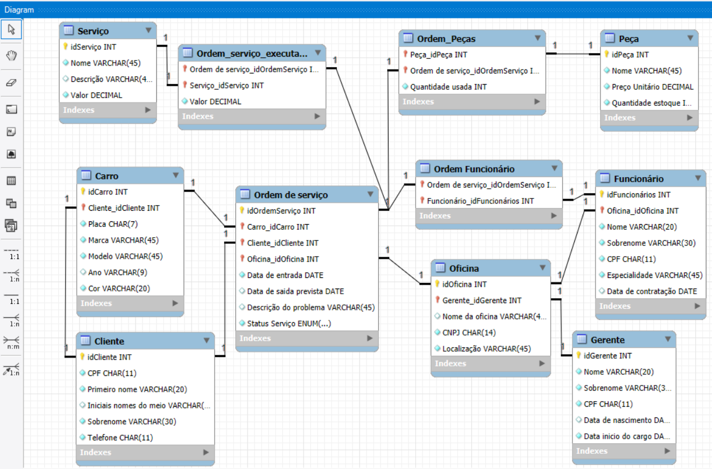

# Projeto Lógico de Banco de Dados: Oficina Mecânica 

Projeto focado na criação de um banco de dados relacional completo para um sistema de gerenciamento de oficinas mecânicas

## 1. Descrição do Projeto

O objetivo foi construir um esquema de banco de dados funcional para uma rede de oficinas. O processo incluiu a modelagem lógica, a implementação do script SQL para criar a estrutura, a inserção de dados para popular o banco e a elaboração de consultas para extrair informações

## 2. Refinamentos do Modelo

O modelo foi projetado para refletir regras de negócio complexas, garantindo integridade e performance:

* **Clientes e Carros:** Um cliente pode possuir múltiplos veículos.
* **Múltiplos Funcionários:** Uma Ordem de Serviço pode ter vários funcionários associados a ela (exemplo: um mecânico e um eletricista na mesma ordem de serviço). Isso é controlado pela tabela "EmployeeOrder".
* **Custo da Ordem (Peças e Serviços):** Uma ordem de serviço é composta por múltiplas peças e múltiplos serviços.
* **Preço Calculado:** O valor total da ordem de serviço não é armazenado, e sim calculado dinamicamente pela soma dos preços das peças e serviços executados, evitando inconsistência nos dados

## 3. Esquema Lógico (Tabelas Criadas)



O banco de dados "CarWorkshop" é composto pelas seguintes tabelas:

* `Clients`: Armazena os dados dos clientes da oficina
* `Car`: Armazena os veículos de cada cliente
* `Workshop`: Registra as diferentes filiais da oficina
* `Manager`: Gerentes responsáveis por cada `Workshop`
* `Employee`: Mecânicos e a oficina onde trabalham
* `Part`: Catálogo de peças e controle de estoque
* `Service`: Mão de obra oferecida
* `ServiceOrder`: A tabela central que registra cada ordem de serviço aberta
* `EmployeeOrder`: Tabela que liga os `Employees` a `ServiceOrder`.
* `OrderPart`: Tabela que liga as `Part` a `ServiceOrder`.
* `ServiceOrderExecuted`: Tabela que liga os `Service` (serviços) à `ServiceOrder`.

## 4. Queries SQL (Consultas)

Foram elaboradas queries para extrair informações estratégicas do banco de dados:

---

### Verificando os carros que cada cliente possui:

```sql
Select concat(fname, ' ', lname) as complete_name, c.carBrand, c.model, c.carPlate 
	FROM Car as c
    JOIN Clients as cl ON c.idClient = cl.idClient
    ORDER BY complete_name;
```
---

### Extraindo informações dos funcionários que trabalham na oficina central:

```sql
 Select e.idEmployee, concat(e.fname, ' ', e.lname) as complete_name, e.CPF, e.specialty
	FROM Employee as e
    JOIN Workshop as w ON e.idWorkshop = w.idWorkshop
    WHERE w.WorkshopName = 'Oficina Central';
```
---

### Verificando quantos carros cada cliente possui:

```sql
select concat(fname, ' ', lname) as complete_name, COUNT(ca.idCar) as Number_cars
	FROM Clients as c
    JOIN Car as ca ON c.idClient = ca.idClient
    GROUP BY c.idClient;
```
---

### Extraindo o valor total gasto em cada serviço

```sql
select soe.idServiceOrder, group_concat(S.serviceName SEPARATOR ',') as serviceName, SUM(soe.price) as totalPriceServiceOrder
	FROM ServiceOrderExecuted as soe
    INNER JOIN Service as s ON soe.idService = s.idService
    GROUP BY soe.idServiceOrder;
```
---

### Extraindo infos dos gerentes correlacionando com infos das oficinas em que gerenciam

```sql
select concat(m.fname, ' ', m.lname) as managerName, m.startDate, w.workshopName, w.location, w.CNPJ
	From Manager as m
    JOIN workshop as w ON m.idManager = w.idManager;
```